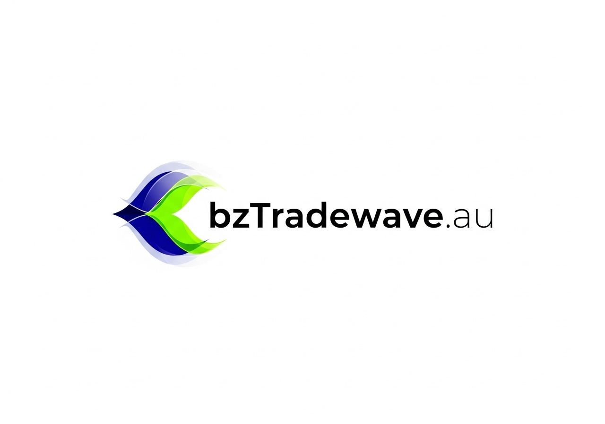

# 🌊 bzTradewave.au

> **Global Trade, Powered by AI. Proudly from Australia.**

A modern, AI-powered international trade platform featuring glassmorphic iOS-style design, real-time market insights, and comprehensive partner management tools.



## ✨ Features

### 🏠 **Homepage**
- **Glassmorphic Design**: Modern iOS-inspired interface with frosted glass effects
- **Real-time Statistics**: Live trade data with animated counters
- **Interactive World Map**: Global presence visualization with partner offices
- **AI Insights Dashboard**: Live market intelligence and trend analysis
- **Product Showcase**: Agriculture, Electronics, and Clothing sectors
- **Contact System**: Professional inquiry handling

### 👥 **Partner Portal**
- **Secure Authentication**: JWT-based login system
- **Personal Dashboard**: Trade statistics and performance metrics
- **Document Management**: File upload and sharing capabilities
- **Notes System**: Personal trade notes and reminders
- **Team Communication**: Chat interface with company representatives

### 🔧 **Admin Dashboard**
- **Trade Player Management**: Comprehensive database of industry contacts
- **Market Research Tools**: AI-powered competitor analysis
- **Contact Management**: Lead tracking and follow-up systems
- **Analytics Dashboard**: Market share and trend visualization

### 🤖 **AI-Powered Features**
- **Real-time Market Data**: Live trade statistics and trends
- **Predictive Analytics**: Market opportunity identification
- **Supply Chain Alerts**: Risk assessment and notifications
- **Automated Insights**: AI-generated market recommendations

## 🛠️ Technology Stack

### Frontend
- **React 18** - Modern UI framework
- **Vite** - Fast build tool and dev server
- **Tailwind CSS** - Utility-first styling
- **Framer Motion** - Smooth animations
- **Recharts** - Data visualization
- **Lucide React** - Beautiful icons

### Backend
- **Flask** - Python web framework
- **SQLAlchemy** - Database ORM
- **JWT** - Authentication tokens
- **SQLite** - Database (production-ready)
- **Flask-CORS** - Cross-origin support

### Design System
- **Glassmorphism** - Modern frosted glass effects
- **Responsive Design** - Mobile-first approach
- **Accessibility** - WCAG compliant
- **Performance** - Optimized loading and animations

## 🚀 Quick Start

### Prerequisites
- Node.js 18+
- Python 3.11+
- npm or yarn

### Installation

1. **Clone the repository**
   ```bash
   git clone https://github.com/your-username/bztradewave.git
   cd bztradewave
   ```

2. **Setup Frontend**
   ```bash
   cd frontend
   npm install
   npm run dev
   ```

3. **Setup Backend**
   ```bash
   cd backend
   python -m venv venv
   source venv/bin/activate  # Windows: venv\Scripts\activate
   pip install -r requirements.txt
   python src/main.py
   ```

4. **Access the Application**
   - Frontend: http://localhost:5173
   - Backend API: http://localhost:5000

## 📁 Project Structure

```
bztradewave/
├── frontend/                 # React frontend application
│   ├── src/
│   │   ├── components/      # React components
│   │   ├── assets/          # Images and static files
│   │   └── App.jsx          # Main application component
│   ├── public/              # Public assets
│   └── package.json         # Frontend dependencies
├── backend/                 # Flask backend application
│   ├── src/
│   │   ├── models/          # Database models
│   │   ├── routes/          # API endpoints
│   │   └── main.py          # Flask application entry point
│   └── requirements.txt     # Backend dependencies
├── DEPLOYMENT_GUIDE.md      # Comprehensive deployment instructions
└── README.md               # This file
```

## 🎨 Design Philosophy

### Glassmorphism
- **Frosted Glass Effects**: Semi-transparent backgrounds with blur
- **Depth and Layering**: Multiple glass panels with shadows
- **Subtle Animations**: Smooth transitions and hover effects
- **Modern Aesthetics**: Clean, minimalist design language

### Color Palette
- **Primary Blue**: #1e3a8a (Deep, professional blue)
- **Accent Green**: #10b981 (Vibrant, growth-oriented green)
- **Neutral Grays**: Various shades for text and backgrounds
- **Gradient Backgrounds**: Dynamic, engaging visual elements

## 📊 API Endpoints

### Public Endpoints
- `GET /api/trade-stats` - Current trade statistics
- `GET /api/market-insights` - AI-powered market insights
- `GET /api/trade-trends` - Historical trend data
- `POST /api/contact` - Contact form submission

### Authentication
- `POST /api/auth/register` - User registration
- `POST /api/auth/login` - User login
- `GET /api/auth/verify` - Token verification

### Protected Endpoints
- `GET /api/partner/dashboard` - Partner dashboard data
- `POST /api/partner/notes` - Save partner notes
- `GET /api/admin/players` - Trade player management

## 🌐 Deployment

See [DEPLOYMENT_GUIDE.md](./DEPLOYMENT_GUIDE.md) for comprehensive deployment instructions including:
- Free hosting options (Netlify, Vercel, Railway)
- VPS deployment with Nginx
- Domain configuration and SSL setup
- Environment variables and security considerations

## 🔐 Security Features

- **JWT Authentication**: Secure token-based authentication
- **Password Hashing**: Werkzeug security for password protection
- **CORS Configuration**: Proper cross-origin request handling
- **Input Validation**: Server-side validation for all inputs
- **SQL Injection Protection**: SQLAlchemy ORM prevents SQL injection

## 📱 Mobile Responsiveness

The application is fully responsive and optimized for:
- **Desktop**: 1920px and above
- **Laptop**: 1024px - 1919px
- **Tablet**: 768px - 1023px
- **Mobile**: 320px - 767px

## 🎯 Business Sectors

### 🌾 Agriculture
- Premium agricultural products from Australia
- Organic certification and quality assurance
- Global distribution network
- Sustainable farming practices

### ⚡ Electronics
- Cutting-edge technology solutions
- Latest electronics and components
- Bulk orders and technical support
- Innovation-driven partnerships

### 👕 Clothing & Garments
- Fashion-forward clothing and garments
- Sustainable materials and ethical production
- Custom orders and fashion trends
- Global fashion market access

## 📈 Performance Metrics

- **Lighthouse Score**: 95+ (Performance, Accessibility, SEO)
- **First Contentful Paint**: < 1.5s
- **Time to Interactive**: < 3s
- **Mobile Performance**: Optimized for 3G networks

## 🤝 Contributing

1. Fork the repository
2. Create a feature branch (`git checkout -b feature/amazing-feature`)
3. Commit your changes (`git commit -m 'Add amazing feature'`)
4. Push to the branch (`git push origin feature/amazing-feature`)
5. Open a Pull Request

## 📄 License

This project is licensed under the MIT License - see the [LICENSE](LICENSE) file for details.

## 📞 Contact

- **Email**: connect@bztradewave.au
- **Website**: https://bztradewave.au
- **Location**: Proudly from Australia 🇦🇺

---

**Part of the premium website family by NextWave.au, Australia.**

Built with ❤️ using modern web technologies and AI-powered insights.

